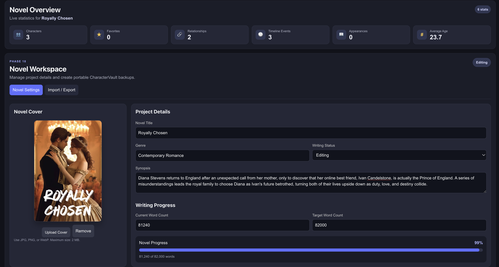
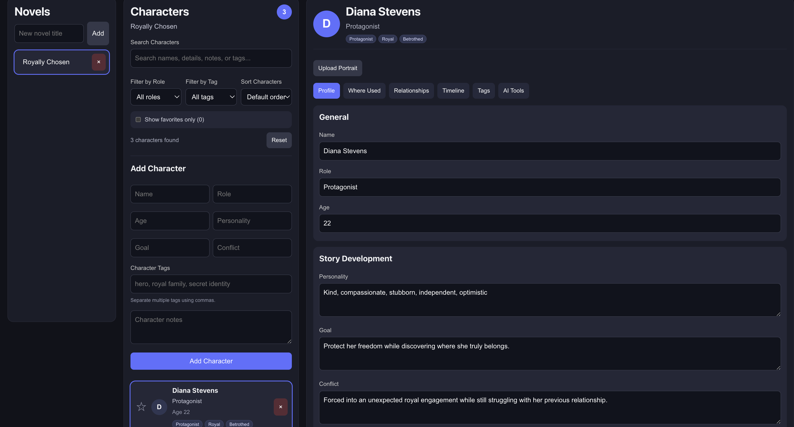
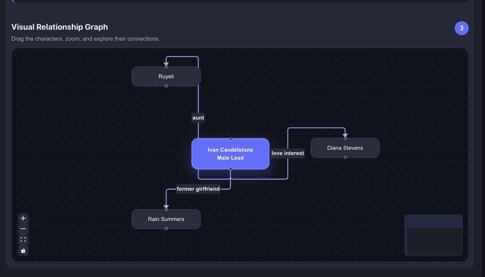
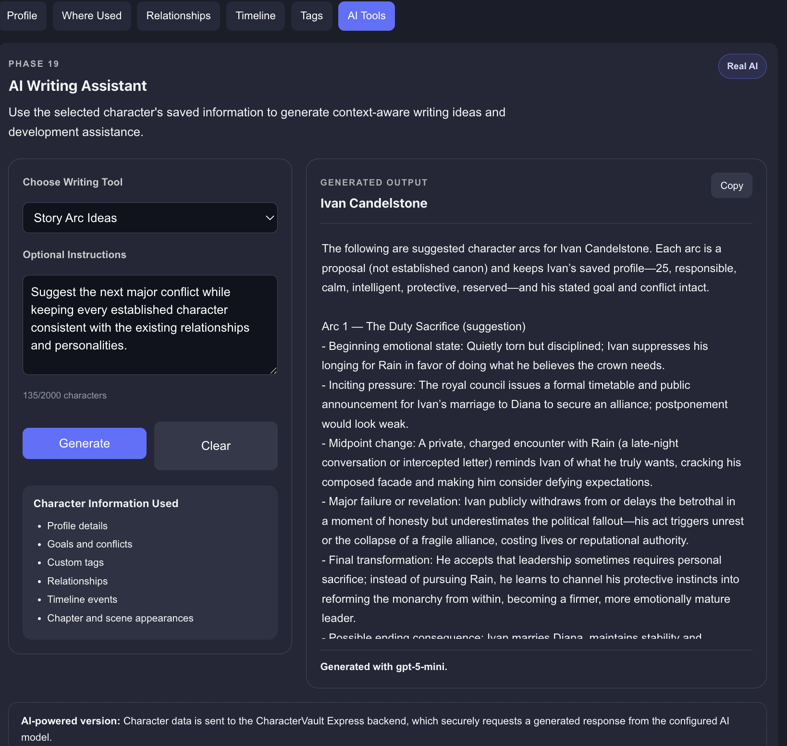

# CharacterVault

CharacterVault is a full-stack web application that helps fiction writers organize novels, manage detailed character profiles, track story continuity, visualize character relationships, and generate AI-assisted writing ideas.

Built with React, Express.js, and the OpenAI Responses API, CharacterVault combines story planning, visualization, and AI assistance into a single writing workspace.

## Live Application

**Frontend:**  
https://character-vault-three.vercel.app

**Backend Health Check:**  
https://character-vault-api.onrender.com/api/health

> **Note:** The backend is hosted on Render's free tier. The first AI request after a period of inactivity may take up to one minute while the backend wakes up.

## Screenshots

### Dashboard



### Character Profile



### Relationship Graph



### AI Writing Assistant



## Application Architecture

```text
React (Vite Frontend)
          │
          ▼
Express.js REST API
          │
          ▼
OpenAI Responses API
```

## Features

### Current Features

- Create, select, and delete multiple novels
- Add, edit, select, and delete characters within each novel
- Store detailed character information including:
  - Name
  - Role
  - Age
  - Personality
  - Goal
  - Conflict
  - Notes
  - Custom tags
- Search characters across multiple profile fields, including tags
- Filter characters by role
- Filter characters by custom tags
- Sort characters alphabetically, by age, favorite status, or number of tags
- Mark important characters as favorites
- Show favorite characters only
- Upload and remove character portraits
- Manage custom character tags
- Display reusable tag badges throughout the application
- Track where characters appear using chapter, scene, and scene-note entries
- Add and delete character relationships
- Visualize relationships using an interactive relationship graph
- Track major character timeline events
- View a novel statistics dashboard
- Organize character information using profile tabs
- Save novels, characters, portraits, relationships, timelines, tags, and favorite status using LocalStorage
- Responsive three-panel interface built with reusable React components
- Upload and remove novel covers
- Store novel genres and synopses
- Track writing status
- Track current and target word counts
- View automatic writing-progress percentages
- Export one novel as a JSON backup
- Export the complete CharacterVault workspace
- Import previously exported JSON backups
- Validate imported CharacterVault data
- Generate AI-assisted character summaries
- Generate personality analyses
- Generate dialogue scenes
- Generate story arc ideas
- Generate backstory and conflict ideas
- Analyze character relationships and timelines
- Send optional writer instructions
- Copy generated output to the clipboard
- Display loading, success, and error states
- Process AI requests securely through the Express backend

## Tech Stack

### Frontend

- React
- JavaScript (ES6+)
- Vite
- CSS3
- React Flow

### Backend

- Node.js
- Express.js
- OpenAI JavaScript SDK
- OpenAI Responses API
- REST APIs

### Storage

- LocalStorage
- JSON
- FileReader API
- Blob API

### Deployment

- Vercel
- Render
- GitHub

### Browser APIs

- Fetch API
- FileReader API
- Blob API

## Project Structure

```text
charactervault/
├── src/
│   ├── components/
│   ├── services/
│   ├── App.jsx
│   └── main.jsx
├── server/
│   ├── routes/
│   ├── services/
│   ├── server.js
│   └── package.json
├── docs/
│   └── screenshots/
├── package.json
└── README.md
```

## Application Components

### `App.jsx`

- Stores the application's main state
- Manages novel CRUD operations
- Manages character CRUD operations
- Updates character relationships
- Updates timeline events
- Updates chapter and scene references
- Saves application data to LocalStorage

### `NovelList.jsx`

- Displays all novels
- Creates new novels
- Selects novels
- Deletes novels

### `CharacterList.jsx`

- Displays characters for the selected novel
- Creates new characters
- Deletes characters
- Searches character information
- Filters characters by role and tags
- Sorts characters by name, age, favorite status, or number of tags
- Displays character portraits
- Displays character tag badges
- Marks and unmarks favorite characters

### `CharacterProfile.jsx`

- Displays and edits detailed character information
- Uploads and removes character portraits
- Organizes information into Profile, Where Used, Relationships, Timeline, Tags, and AI Tools tabs
- Manages custom character tags
- Tracks chapter and scene appearances
- Manages character relationships
- Records character timeline events
- Provides an AI Writing Assistant workspace
- Generates structured writing assistance using saved character data
- Supports summaries, personality analysis, dialogue, story arcs, relationships, backstories, conflicts, and timeline reviews
- Includes loading, empty, status, clear, and copy states

### `NovelTools.jsx`

- Manages novel covers and project metadata
- Updates genres, synopses, and writing status
- Tracks current and target word counts
- Calculates writing progress
- Exports selected novels as JSON
- Exports the complete workspace as JSON
- Imports and validates CharacterVault backups

### Backend

- Provides a health-check endpoint
- Validates AI generation requests
- Builds context-aware prompts from character data
- Calls the OpenAI Responses API
- Keeps API credentials outside the browser
- Handles request validation, rate limiting, and server errors

## Data Persistence

CharacterVault currently uses browser LocalStorage.

This allows novels and character data to remain available after refreshing the browser without requiring a backend database.

Character portraits are converted into Base64 strings using the FileReader API and stored directly with each character. JSON import and export provide portable backups until cloud synchronization is implemented.

## Why I Built CharacterVault

As someone who enjoys writing novels, I often found it difficult to remember character relationships, chapter appearances, timelines, and important story details across long manuscripts.

Instead of relying on scattered notes and documents, I built CharacterVault to provide a centralized workspace where writers can organize stories, visualize relationships, and use AI to assist with character development and brainstorming.

## Project Status

✅ CharacterVault is complete and publicly deployed.

CharacterVault includes a production-ready React frontend, an Express.js backend, OpenAI Responses API integration, interactive relationship visualization, JSON import and export, responsive design, and cloud deployment using Vercel and Render.

## Security

- OpenAI API keys are stored only in backend environment variables
- API keys are never exposed to the browser
- Frontend requests are restricted through CORS
- AI requests are protected with Express rate limiting
- AI requests are validated before reaching the OpenAI API
- Character portrait data is removed before AI requests are sent

## Current Limitations

- Data is stored in browser LocalStorage
- No user authentication
- No cloud synchronization
- No PostgreSQL database
- Rate limiting currently uses an in-memory store
- The public demo shares a single backend AI service

## Future Improvements

- User authentication
- PostgreSQL database
- Cloud synchronization
- Shared writing projects
- AI-powered story continuity checker
- Character consistency analysis
- User-specific AI usage limits
- Automated testing